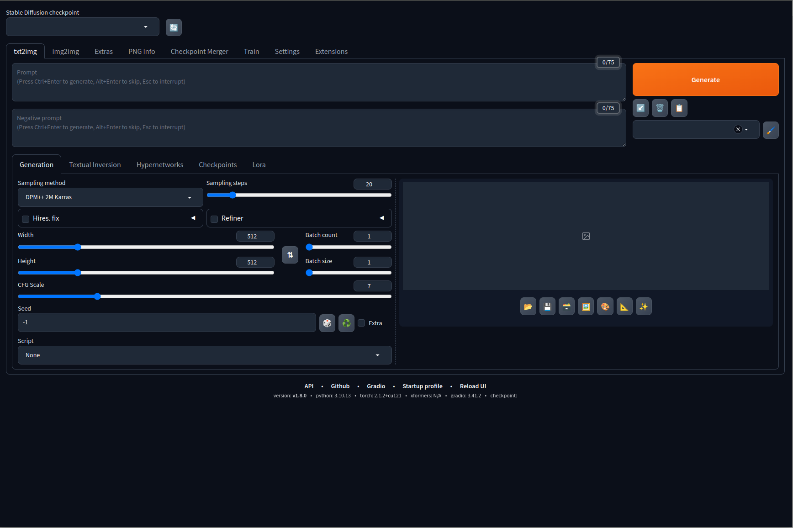
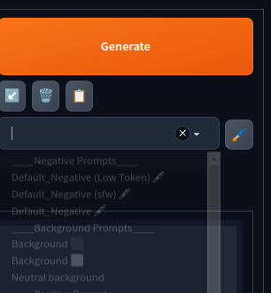

# AUTOMATIC1111 Configuration

This guide details the supplementary steps required to configure your AUTOMATIC1111 setup, enabling you to execute any documented use-case within this repository. It is presumed that you have successfully launched AUTOMATIC1111 by adhering to the official instructions and can view the specified interface in your browser.

## Installing extensions

By navigating to the Extensions tab and choosing install from URL, you have the ability to download a range of extensions. The following list encompasses all the base extensions to explore every use-case documented in this repository. Simply copy and paste each URL into the provided field and click Install for each one. The installation time for each extension may vary, typically requiring a minute or two to complete.

| Name                | Description                                                               | URL                                             |
|---------------------|---------------------------------------------------------------------------|-------------------------------------------------|
| sd-webui-controlnet | The WebUI extension for ControlNet and other injection-based SD controls. | https://github.com/Mikubill/sd-webui-controlnet.git |

Once all the extensions have been installed, you can either select Apply and restart UI from the Installed tab to refresh the interface, or opt to completely restart the web server for the changes to take effect.

## Populating style selector

There are a variety of extensions that also solves this requirement (eg. [stylez](https://github.com/javsezlol1/stylez)) but for simplicity, I'm covering how to use a `styles.csv` file to populate the style selector box in the standard AUTOMATIC1111 UI. You can search the web to find a collection of premade styles (eg. on [reddit](https://www.reddit.com/r/StableDiffusion/comments/11mkefu/is_there_a_collection_of_styles_for_web_ui_i/)) and after downloading the file, you can place it under the root directory of your `stable-diffusion-webui` installation.

