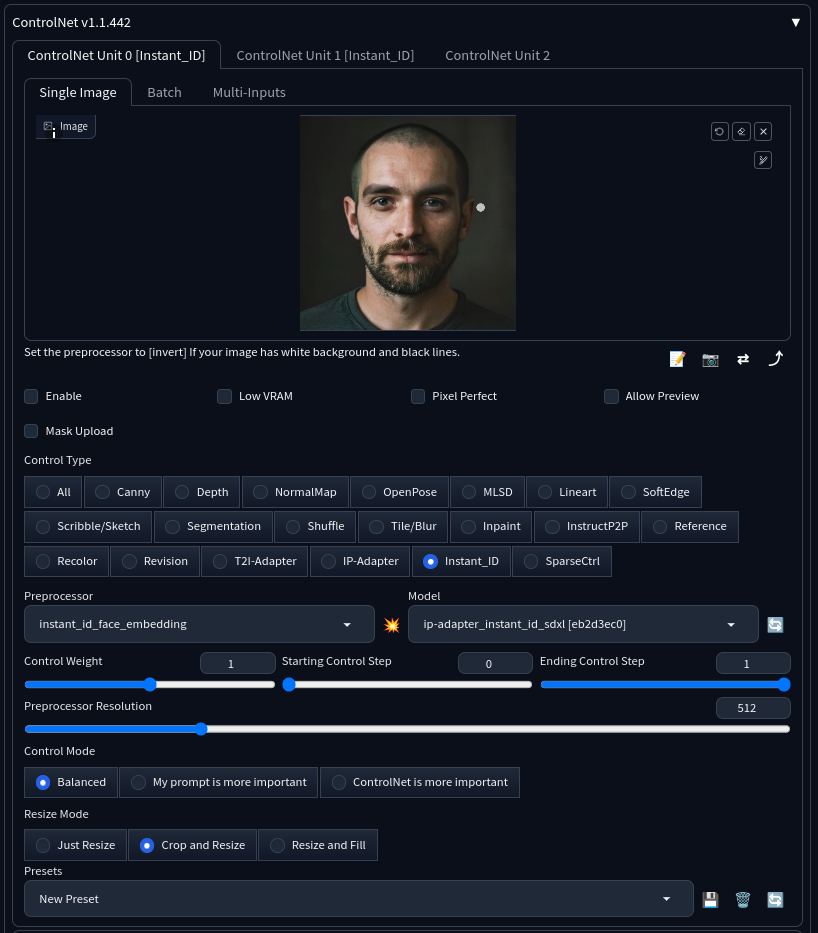

# Instant

## Install insightface

When installing insightface, ensure you are using the virtual python env as part of program.
This can be done with activating the virtual env with.

`source venv/bin/activate`
`pip install insightface`

## Download models

Download the following two models:

- [ipadapter model](https://huggingface.co/InstantX/InstantID/resolve/main/ip-adapter.bin?download=true)
- [ControlNet model](https://huggingface.co/InstantX/InstantID/resolve/main/ControlNetModel/diffusion_pytorch_model.safetensors?download=true)

Ensure you rename them to: `ip-adapter_instant_id_sdxl` and `control_instant_id_sdx` and place them under `models/ControlNet`.

## Configuring the ControlNets

Configure 2 control nets. The first is for embeddings:

- provide one or multi-input images
- toggle `Enable` to activate the ControlNet
- select `instant_ID` as Control Type
- set preprocessor to `instant_id_face_embedding`
- set model to `ip-adapter_instant_id_sdxl`
- set Control weight to `0.5`
- set preprocessor resolution to `1024` (matching your original image)

The second is is for keypoints:

- provide one or multi-input images
- toggle `Enable` to activate the ControlNet
- select `instant_ID` as Control Type
- set preprocessor to `instant_id_face_keypoints`
- set model to `control_instant_id_sdxl`
- set Control weight to `0.5`
- set Ending Control Step to `0.25`
- set preprocessor resolution to `1024` (matching your original image)

## Configuring the generation

- sample method `DPM++ SDE Karras`
- sampling steps of `8`
- CFG scale of `4`
